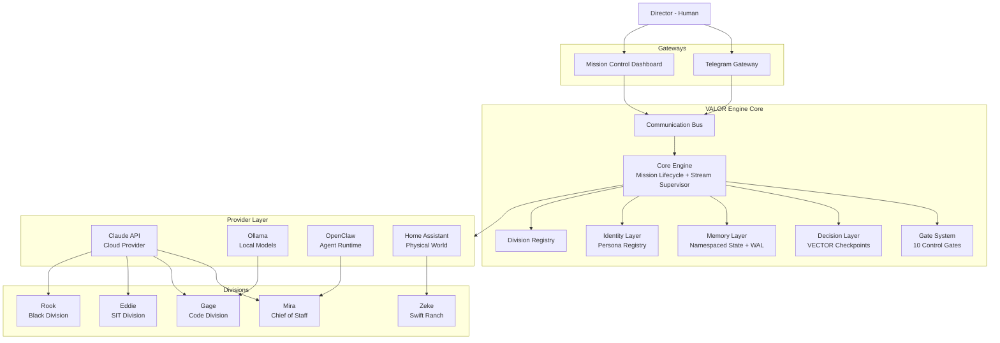
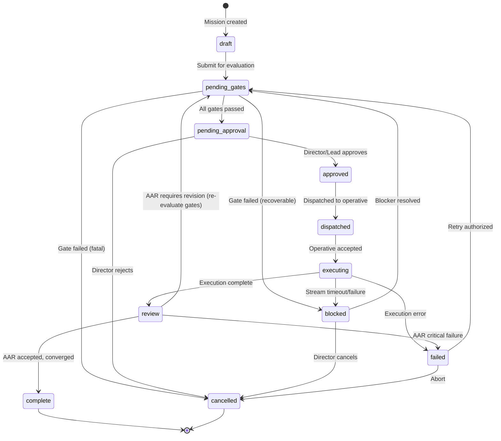
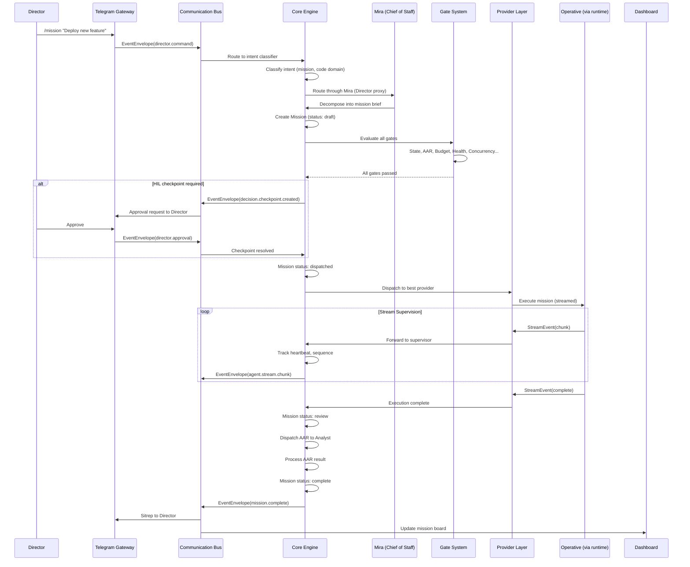
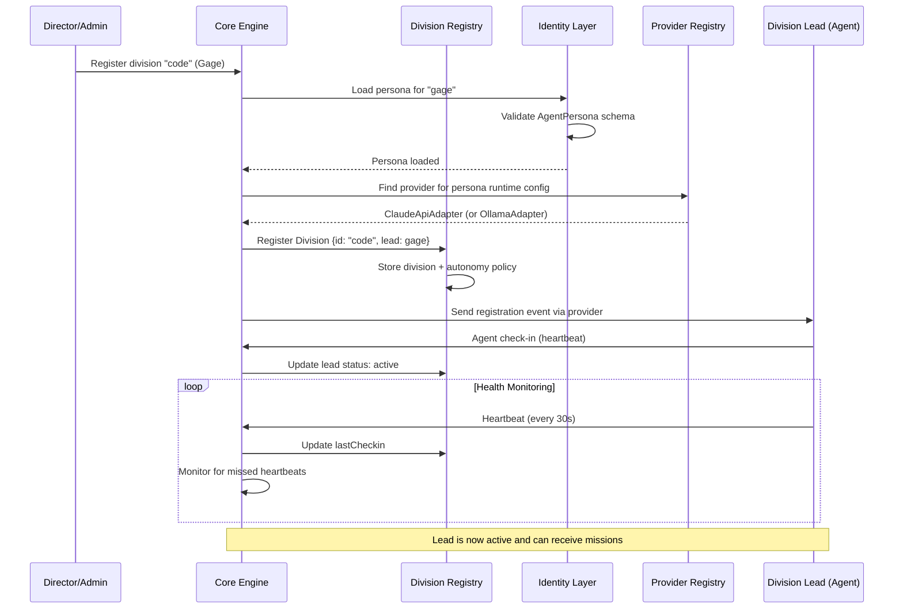

# Phase 3 -- Integration Architecture

> Generated: 2026-03-05 | Input: `docs/01-DISCOVERY.md`, `docs/02-DEPENDENCIES.md`

---

## Table of Contents

1. [Architectural Principles](#architectural-principles)
2. [Layer Overview](#layer-overview)
3. [Layer 1: Core Engine](#layer-1-core-engine)
4. [Layer 2: Provider Layer](#layer-2-provider-layer)
5. [Layer 3: Identity Layer](#layer-3-identity-layer)
6. [Layer 4: Memory Layer](#layer-4-memory-layer)
7. [Layer 5: Decision Layer](#layer-5-decision-layer)
8. [Layer 6: Communication Bus](#layer-6-communication-bus)
9. [Layer 7: Division Schema](#layer-7-division-schema)
10. [System Diagrams](#system-diagrams)

---

## Architectural Principles

1. **Orchestration, not execution.** The engine dispatches and monitors; agents do the work.
2. **Typed everything.** Zod schemas as SSoT. No `any`, no string parsing, no silent failures.
3. **Streaming first.** Every provider interaction is stream-supervised with heartbeat, timeout, and recovery.
4. **Observable by default.** Every state mutation, message, and decision is logged to the audit trail.
5. **Fail loud, recover smart.** Typed error categories with recovery strategies. Never swallow errors.
6. **Runtime-agnostic dispatch.** The engine doesn't care if an agent runs on OpenClaw, Claude API, Ollama, or a future runtime. The provider layer abstracts this.

---

## Layer Overview

```
┌─────────────────────────────────────────────────────────────────────┐
│                        DIRECTOR (Human)                             │
│              Telegram | Dashboard | Direct CLI                      │
└──────────────────────────────┬──────────────────────────────────────┘
                               │
┌──────────────────────────────▼──────────────────────────────────────┐
│  LAYER 6: COMMUNICATION BUS                                         │
│  Typed event envelope, pub/sub, guaranteed delivery, audit trail     │
├─────────────────────────────────────────────────────────────────────┤
│  LAYER 1: CORE ENGINE                                               │
│  Mission lifecycle, stream supervisor, failure router, WAL           │
├─────────┬───────────┬───────────┬────────────┬──────────────────────┤
│ LAYER 2 │ LAYER 3   │ LAYER 4   │ LAYER 5    │ LAYER 7             │
│ Provider│ Identity   │ Memory    │ Decision   │ Division            │
│ Layer   │ Layer      │ Layer     │ Layer      │ Schema              │
│         │            │           │ (VECTOR)   │                     │
│ClaudeAPI│ Soulsmith  │ Namespaced│ Gate eval  │ Registration        │
│ Ollama  │ SSOP types │ state     │ Checkpoint │ Lead instantiation  │
│ OpenClaw│ Personas   │ WAL/audit │ Approval Q │ Autonomy policies   │
│ Custom  │            │           │            │ Escalation rules    │
└─────────┴───────────┴───────────┴────────────┴──────────────────────┘
                               │
┌──────────────────────────────▼──────────────────────────────────────┐
│  AGENTS (External Processes)                                        │
│  Mira (OpenClaw) | Gage (OpenClaw) | Zeke (Ollama/HA) | Operatives │
└─────────────────────────────────────────────────────────────────────┘
```

---

## Layer 1: Core Engine

The central orchestration authority. Manages mission lifecycle, stream supervision, failure routing, and the transaction log.

### Existing Components That Map Here

| Component | What Maps | Adapter Work |
|-----------|----------|-------------|
| **VALOR v1 Director** | Intent classification, session management, handler dispatch, MCP tool routing | Extract Director's routing logic; replace Express with engine's event-driven model |
| **VALOR v3 Orchestrator** | Mission lifecycle, 8 control gates, AAR pipeline, cost tracking, health scoring | Lift gate evaluation, scheduler, and cost tracker into shared engine core |
| **Prior EventBus patterns** | Session manager, event bus, permission engine | Reuse EventBus pattern; adapt session model for mission scope |

### What Must Be Built New

- **Stream Supervisor** -- Wraps all provider interactions with heartbeat detection, sequence tracking, timeout, and typed failure recovery
- **Mission State Machine** -- Unified lifecycle (merges v1 dispatch + v3 gates + approval queue)
- **Transaction Log (WAL)** -- SQLite-backed append-only log for all state mutations (conversations, missions, decisions)
- **Failure Router** -- Maps typed error categories to recovery strategies

### Key Interfaces

```typescript
import { z } from 'zod';

// ─── Mission Lifecycle ───────────────────────────────────

export const MissionStatus = z.enum([
  'draft',           // Created, not yet evaluated
  'pending_gates',   // Awaiting gate evaluation
  'pending_approval',// Gates passed, awaiting HIL approval
  'approved',        // Approved, queued for dispatch
  'dispatched',      // Sent to operative
  'executing',       // Operative working (stream active)
  'review',          // Awaiting AAR (peer review)
  'complete',        // Successfully finished
  'failed',          // Failed with typed error
  'blocked',         // Blocked by dependency or gate
  'cancelled',       // Cancelled by Director or escalation
]);
export type MissionStatus = z.infer<typeof MissionStatus>;

export const MissionSchema = z.object({
  id: z.string().uuid(),
  projectId: z.string().uuid().optional(),
  title: z.string(),
  objective: z.string(),
  status: MissionStatus,
  assignedDivision: z.string(),
  assignedOperative: z.string().optional(),
  priority: z.enum(['critical', 'high', 'medium', 'low']),
  dependencies: z.array(z.string().uuid()),
  constraints: z.array(z.string()),
  toolPolicy: z.object({
    allowed: z.array(z.string()),
    denied: z.array(z.string()),
    requiresApproval: z.array(z.string()),
  }),
  gateResults: z.array(z.object({
    gate: z.string(),
    passed: z.boolean(),
    reason: z.string().optional(),
    evaluatedAt: z.string().datetime(),
  })),
  cost: z.object({
    estimated: z.number(),
    actual: z.number(),
    model: z.string(),
  }).optional(),
  createdAt: z.string().datetime(),
  updatedAt: z.string().datetime(),
  completedAt: z.string().datetime().optional(),
});
export type Mission = z.infer<typeof MissionSchema>;

// ─── Stream Supervision ──────────────────────────────────

export const StreamEventSchema = z.object({
  streamId: z.string().uuid(),
  missionId: z.string().uuid(),
  sequenceNumber: z.number().int(),
  type: z.enum([
    'heartbeat',
    'chunk',
    'tool_use',
    'tool_result',
    'error',
    'complete',
    'timeout',
  ]),
  timestamp: z.string().datetime(),
  payload: z.unknown(),
});
export type StreamEvent = z.infer<typeof StreamEventSchema>;

export interface StreamSupervisor {
  /** Start supervising a stream for a mission */
  supervise(missionId: string, stream: AsyncIterable<StreamEvent>): Promise<void>;
  /** Get stream health for a mission */
  getHealth(missionId: string): StreamHealth;
  /** Abort a supervised stream */
  abort(missionId: string, reason: string): Promise<void>;
}

export interface StreamHealth {
  streamId: string;
  missionId: string;
  lastHeartbeat: Date;
  sequenceGaps: number[];
  totalChunks: number;
  totalErrors: number;
  status: 'healthy' | 'degraded' | 'stale' | 'dead';
}

// ─── Typed Error Categories ──────────────────────────────

export const ErrorCategory = z.enum([
  'network',        // Connection failures, timeouts
  'auth',           // Authentication/authorization failures
  'validation',     // Schema validation, malformed data
  'provider',       // LLM provider errors (rate limit, model unavailable)
  'governance',     // OATH violation, gate failure
  'budget',         // Cost exceeded
  'timeout',        // Operation timeout
  'agent',          // Agent-reported errors
  'system',         // Internal engine errors
]);
export type ErrorCategory = z.infer<typeof ErrorCategory>;

export const RecoveryStrategy = z.enum([
  'retry',          // Retry with backoff
  'fallback',       // Try alternate provider/model
  'escalate',       // Escalate to Director
  'abort',          // Abort mission
  'quarantine',     // Isolate and log for review
]);
export type RecoveryStrategy = z.infer<typeof RecoveryStrategy>;

export const EngineErrorSchema = z.object({
  id: z.string().uuid(),
  category: ErrorCategory,
  message: z.string(),
  context: z.record(z.unknown()),
  recovery: RecoveryStrategy,
  missionId: z.string().uuid().optional(),
  agentId: z.string().optional(),
  timestamp: z.string().datetime(),
  resolved: z.boolean(),
});
export type EngineError = z.infer<typeof EngineErrorSchema>;

// ─── Transaction Log (WAL) ───────────────────────────────

export const WALEntrySchema = z.object({
  id: z.number().int(),
  timestamp: z.string().datetime(),
  table: z.string(),
  operation: z.enum(['INSERT', 'UPDATE', 'DELETE']),
  entityId: z.string(),
  before: z.unknown().nullable(),
  after: z.unknown().nullable(),
  actorId: z.string(),     // Who caused this change (agent, director, system)
  actorType: z.enum(['agent', 'director', 'system', 'gate']),
  missionId: z.string().uuid().optional(),
});
export type WALEntry = z.infer<typeof WALEntrySchema>;

// ─── Gate System (from VALOR v3, extended) ───────────────

export interface Gate {
  name: string;
  evaluate(mission: Mission, context: GateContext): Promise<GateResult>;
}

export interface GateContext {
  project?: any;      // Project state (if project-scoped)
  division: any;      // Division state
  budget: { spent: number; limit: number };
  health: { score: number; threshold: number };
  activeMissions: number;
  maxParallel: number;
}

export interface GateResult {
  gate: string;
  passed: boolean;
  reason?: string;
  evaluatedAt: Date;
}

// Built-in gates (from v3, extended with v1 governance):
// 1. MissionStateGate
// 2. AARGate (peer review required)
// 3. ConvergenceGate
// 4. RevisionCapGate
// 5. HealthGate
// 6. ArtifactIntegrityGate
// 7. BudgetGate
// 8. ConcurrencyGate
// 9. OathGate (from v1 -- Layer 0 constitutional checks)
// 10. HILGate (human-in-loop approval routing)
```

---

## Layer 2: Provider Layer

Unifies cloud APIs and local model endpoints under a single protocol-level dispatch interface. Adapters speak standard protocols (Anthropic API, OpenAI API, Ollama HTTP) — no external SIT projects (Herd Pro, Conduit) are dependencies.

### Existing Components

| Component | Maps To | Adapter Work |
|-----------|---------|-------------|
| **Anthropic SDK** | Direct Claude API access | Wrap in `ProviderAdapter` interface |
| **Ollama HTTP protocol** | Local model endpoint (any Ollama-compatible server) | Wrap HTTP API in `ProviderAdapter` interface |
| **VALOR v3 Provider** | Anthropic + OpenAI adapters | Lift into shared provider layer; add rate limiting |
| **VALOR v1 ClaudeClient** | Direct Anthropic SDK usage | Replace with provider layer calls |

### What Must Be Built New

- **Unified `ProviderAdapter` interface** that works for cloud APIs (Claude, OpenAI), local Ollama, OpenClaw, and custom runtimes
- **Provider registry** with health checking and capability discovery
- **Fallback chain** logic (from v3, generalized)
- **Home Assistant adapter** for Zeke's physical world operations

### Key Interfaces

```typescript
// ─── Provider Abstraction ────────────────────────────────

export interface ProviderAdapter {
  readonly id: string;
  readonly name: string;
  readonly type: ProviderType;
  readonly capabilities: ProviderCapabilities;

  /** Check if provider is healthy and ready */
  healthCheck(): Promise<ProviderHealth>;

  /** Send a message and get a streaming response */
  stream(request: ProviderRequest): AsyncIterable<StreamEvent>;

  /** Send a message and get a complete response */
  complete(request: ProviderRequest): Promise<ProviderResponse>;

  /** List available models on this provider */
  listModels(): Promise<ModelInfo[]>;
}

export type ProviderType = 'claude_api' | 'openai_api' | 'ollama' | 'openclaw' | 'home_assistant' | 'custom';

export interface ProviderCapabilities {
  streaming: boolean;
  toolUse: boolean;
  vision: boolean;
  maxContextTokens: number;
  models: string[];
}

export interface ProviderRequest {
  model: string;
  messages: Array<{ role: 'user' | 'assistant' | 'system'; content: string }>;
  tools?: ToolDefinition[];
  maxTokens?: number;
  temperature?: number;
  stream?: boolean;
}

export interface ProviderResponse {
  content: string;
  model: string;
  usage: { inputTokens: number; outputTokens: number };
  toolCalls?: ToolCall[];
  stopReason: 'end_turn' | 'tool_use' | 'max_tokens' | 'error';
}

export interface ProviderHealth {
  status: 'healthy' | 'degraded' | 'unavailable';
  latencyMs: number;
  lastCheck: Date;
  details?: Record<string, unknown>;
}

export interface ModelInfo {
  id: string;
  name: string;
  provider: string;
  contextWindow: number;
  costPer1kInput: number;
  costPer1kOutput: number;
}

// ─── Provider Registry ───────────────────────────────────

export interface ProviderRegistry {
  register(provider: ProviderAdapter): void;
  get(id: string): ProviderAdapter | undefined;
  getByType(type: ProviderType): ProviderAdapter[];
  getBestFor(request: DispatchCriteria): ProviderAdapter | undefined;
  healthCheckAll(): Promise<Map<string, ProviderHealth>>;
}

export interface DispatchCriteria {
  model?: string;
  capabilities?: Partial<ProviderCapabilities>;
  preferLocal?: boolean;        // Prefer local Ollama over cloud API
  maxCostPer1kTokens?: number;  // Budget constraint
  division?: string;            // Division-specific routing
}

// ─── Concrete Adapters (to be implemented) ───────────────

// ClaudeApiAdapter: Uses @anthropic-ai/sdk directly
//   - Standard Anthropic Messages API
//   - Rate limiting from v3's ProviderRateLimiterRegistry
//   - Streaming via SDK's stream() method

// OllamaAdapter: Speaks standard Ollama HTTP protocol
//   - Works with bare Ollama, Herd Pro, or any Ollama-compatible proxy
//   - Uses /api/chat for completions, /api/tags for health
//   - No dependency on any specific gateway product

// OpenClawAdapter: Wraps OpenClaw webhook API
//   - For governing Mira and other OpenClaw agents
//   - Maps OpenClaw webhook events to StreamEvent

// HomeAssistantAdapter: Wraps HA REST API
//   - For Zeke's sensor reads, automation triggers
//   - Maps HA state changes to StreamEvent
```

---

## Layer 3: Identity Layer

How agent personas are provisioned, validated, and loaded.

### Existing Components

| Component | Maps To | Adapter Work |
|-----------|---------|-------------|
| **Soulsmith** | Persona extraction tool | Call as library for provisioning |
| **gage-mem** | Reference Division Lead persona | Template for typed persona schema |
| **analyst/planner workspaces** | Reference operative personas | Template for operative identity |
| **VALOR v1 operative YAMLs** | Named operative definitions | Map to canonical persona schema |
| **VALOR v3 agent profiles** | Stateless agent role definitions | Map to canonical schema |
| **SSOP v2.3** | Persona framework standard | Inform schema field design |

### What Must Be Built New

- **Canonical `AgentPersona` schema** that unifies SSOP markdown, YAML operatives, and JSON profiles
- **Persona registry** backed by SQLite
- **Persona loader** that reads from registry at agent startup

### Key Interfaces

```typescript
// ─── Agent Persona (SSOP-typed) ──────────────────────────

export const AgentPersonaSchema = z.object({
  id: z.string().uuid(),
  callsign: z.string(),
  version: z.string(),

  // SSOP Section 1: Core Identity
  identity: z.object({
    designation: z.string(),
    role: z.enum(['division-lead', 'operative', 'analyst', 'specialist']),
    division: z.string(),
    tone: z.string(),
    temperament: z.string(),
    voice: z.string(),
    visual: z.string().optional(),  // For UI avatar rendering
    emoji: z.string().optional(),
  }),

  // SSOP Section 2: Primary Objective
  objective: z.string(),

  // SSOP Section 3: Domains (weighted expertise)
  domains: z.object({
    primary: z.array(z.object({
      name: z.string(),
      weight: z.enum(['high', 'medium', 'low']),
    })),
    excluded: z.array(z.string()),
  }),

  // SSOP Section 4: Intent Inference Rules
  intentRules: z.array(z.object({
    phrase: z.string(),
    domainContext: z.string(),
    interpretation: z.string(),
  })).optional(),

  // SSOP Sections 5-8: Communication Style
  communication: z.object({
    style: z.string(),
    structuralGuidelines: z.string(),
    verbosity: z.string(),
    closingBehavior: z.string(),
  }),

  // SSOP Section 9: Guardrails
  guardrails: z.array(z.string()),

  // SSOP Section 10: Exclusions
  exclusions: z.array(z.string()),

  // SSOP Section 11: Meta-Behavior
  metaBehavior: z.string().optional(),

  // Runtime Configuration (not part of SSOP but needed by engine)
  runtime: z.object({
    defaultProvider: z.string(),
    defaultModel: z.string(),
    fallbackModel: z.string().optional(),
    maxTokens: z.number().int().optional(),
    temperature: z.number().optional(),
  }),

  // Capabilities
  capabilities: z.object({
    tools: z.array(z.string()),
    autonomousActions: z.array(z.string()),
    requiresApproval: z.array(z.string()),
    prohibited: z.array(z.string()),
  }),

  // Metadata
  createdAt: z.string().datetime(),
  updatedAt: z.string().datetime(),
  source: z.enum(['soulsmith', 'yaml', 'json', 'manual']),
});
export type AgentPersona = z.infer<typeof AgentPersonaSchema>;

// ─── Persona Registry ────────────────────────────────────

export interface PersonaRegistry {
  register(persona: AgentPersona): Promise<void>;
  get(callsign: string): Promise<AgentPersona | undefined>;
  getByDivision(division: string): Promise<AgentPersona[]>;
  update(callsign: string, patch: Partial<AgentPersona>): Promise<void>;
  list(): Promise<AgentPersona[]>;
}
```

---

## Layer 4: Memory Layer

Shared knowledge authority with per-division namespaced state.

### Existing Components

| Component | Maps To | Adapter Work |
|-----------|---------|-------------|
| **VALOR v1 session-store MCP** | Session persistence, sitrep history | Lift data model into memory layer |
| **VALOR v3 context cache** | Rolling snapshot + chronicle | Generalize for all divisions |
| **gage-mem memory/** | Division Lead long-term memory | Represent as namespaced state |
| **Prior conversation stores** | Conversation transcripts | Model as conversation memory |

### What Must Be Built New

- **Namespaced state store** -- per-division isolated state with cross-division read policies
- **Conversation memory** with summarization and context windowing
- **Knowledge base** with full-text search (replaces Mission Control's `/api/knowledge`)
- **State isolation enforcement** (Black Division state cannot leak without Director approval)

### Key Interfaces

```typescript
// ─── Memory Namespaces ───────────────────────────────────

export interface MemoryStore {
  /** Get a value from a division's namespace */
  get(namespace: string, key: string): Promise<unknown | undefined>;

  /** Set a value in a division's namespace */
  set(namespace: string, key: string, value: unknown, actor: string): Promise<void>;

  /** Query within a namespace */
  query(namespace: string, filter: MemoryFilter): Promise<MemoryEntry[]>;

  /** Cross-namespace read (requires authorization) */
  crossRead(
    sourceNamespace: string,
    targetNamespace: string,
    key: string,
    authorization: CrossReadAuth
  ): Promise<unknown | undefined>;
}

export interface MemoryEntry {
  namespace: string;
  key: string;
  value: unknown;
  updatedBy: string;
  updatedAt: Date;
  version: number;
}

export interface MemoryFilter {
  keyPrefix?: string;
  updatedAfter?: Date;
  updatedBy?: string;
  limit?: number;
}

export interface CrossReadAuth {
  requestor: string;       // Agent requesting access
  reason: string;          // Why cross-division access is needed
  directorApproved?: boolean;  // Whether Director pre-approved
}

// ─── Conversation Memory ─────────────────────────────────

export interface ConversationMemory {
  /** Add a message to conversation history */
  addMessage(conversationId: string, message: ConversationMessage): Promise<void>;

  /** Get recent history within context window */
  getWindow(conversationId: string, maxTokens: number): Promise<ConversationMessage[]>;

  /** Get full history for a conversation */
  getHistory(conversationId: string): Promise<ConversationMessage[]>;

  /** Summarize and compact older messages */
  compact(conversationId: string): Promise<void>;
}

export const ConversationMessageSchema = z.object({
  id: z.string().uuid(),
  conversationId: z.string().uuid(),
  role: z.enum(['user', 'assistant', 'system', 'tool']),
  content: z.string(),
  toolCalls: z.array(z.object({
    name: z.string(),
    arguments: z.record(z.unknown()),
    result: z.unknown().optional(),
  })).optional(),
  timestamp: z.string().datetime(),
  tokenCount: z.number().int(),
});
export type ConversationMessage = z.infer<typeof ConversationMessageSchema>;
```

---

## Layer 5: Decision Layer

Where VECTOR Method checkpoints integrate into mission execution flow.

### Existing Components

| Component | Maps To | Adapter Work |
|-----------|---------|-------------|
| **VectorOS MVP Spec** | VECTOR framework definition (6 stages) | Implement as TypeScript types, not Python |
| **VALOR v3 control gates** | Gate evaluation pipeline | Extend with VECTOR checkpoint integration |
| **VALOR v3 approval queue** | HIL checkpoint routing | Reuse for VECTOR review gates |
| **VALOR v1 OathValidator** | Constitutional governance | Integrate as Layer 0 in decision pipeline |

### What Must Be Built New

- **Typed VECTOR analysis** -- the 6 stages (V-E-C-T-O-R) as structured output
- **Decision checkpoint integration** -- VECTOR runs at configurable points in mission lifecycle
- **Bias detection** -- Scored risks from VectorOS spec
- **Decision persistence** -- Store VECTOR analyses for meta-pattern detection

### Key Interfaces

```typescript
// ─── VECTOR Decision Framework ───────────────────────────

export const VECTORAnalysisSchema = z.object({
  id: z.string().uuid(),
  decisionId: z.string().uuid(),
  missionId: z.string().uuid().optional(),

  // Input
  title: z.string(),
  context: z.string(),
  constraints: z.array(z.string()),
  stakes: z.enum(['low', 'medium', 'high']),

  // V-E-C-T-O-R Stages
  visualize: z.object({
    successState: z.string(),
    failureState: z.string(),
    hiddenCosts: z.array(z.string()),
  }),
  evaluate: z.object({
    systemDependencies: z.array(z.string()),
    secondOrderEffects: z.array(z.string()),
    constraintConflicts: z.array(z.string()),
  }),
  choose: z.object({
    reversibilityScore: z.number().int().min(0).max(10),
    optionalityScore: z.number().int().min(0).max(10),
    capitalIntensity: z.enum(['low', 'medium', 'high']),
    riskProfile: z.string(),
  }),
  test: z.object({
    minimumViableTest: z.string(),
    successMetric: z.string(),
    killSignal: z.string(),
    timeframe: z.string(),
  }),
  optimize: z.object({
    frictionPoints: z.array(z.string()),
    automationCandidates: z.array(z.string()),
    assumptionRisks: z.array(z.string()),
  }),
  review: z.object({
    recommendedCheckpointDays: z.array(z.number()),
    reviewQuestions: z.array(z.string()),
  }),

  // Bias Risk Scoring (all 0-10)
  biasRisk: z.object({
    overconfidence: z.number().int().min(0).max(10),
    sunkCost: z.number().int().min(0).max(10),
    confirmationBias: z.number().int().min(0).max(10),
    urgencyDistortion: z.number().int().min(0).max(10),
    complexityUnderestimation: z.number().int().min(0).max(10),
  }),

  // Metadata
  analyzedBy: z.string(),   // Model/agent that produced this
  analyzedAt: z.string().datetime(),
  confidence: z.number().int().min(1).max(10),
});
export type VECTORAnalysis = z.infer<typeof VECTORAnalysisSchema>;

// ─── Decision Checkpoint ─────────────────────────────────

export const DecisionCheckpointSchema = z.object({
  id: z.string().uuid(),
  missionId: z.string().uuid(),
  type: z.enum([
    'pre_mission',       // Before mission dispatch
    'mid_execution',     // During execution (at defined milestones)
    'post_aar',          // After AAR review
    'follow_on',         // Before spawning follow-on missions
    'escalation',        // When escalating to Director
  ]),
  vectorAnalysis: VECTORAnalysisSchema.optional(),
  status: z.enum(['pending', 'approved', 'rejected', 'auto_resolved']),
  resolvedBy: z.string().optional(),
  resolvedAt: z.string().datetime().optional(),
  resolution: z.string().optional(),
  createdAt: z.string().datetime(),
});
export type DecisionCheckpoint = z.infer<typeof DecisionCheckpointSchema>;

// ─── Decision Engine ─────────────────────────────────────

export interface DecisionEngine {
  /** Run VECTOR analysis on a decision */
  analyze(input: {
    title: string;
    context: string;
    constraints: string[];
    stakes: 'low' | 'medium' | 'high';
  }): Promise<VECTORAnalysis>;

  /** Create a checkpoint in mission execution */
  createCheckpoint(
    missionId: string,
    type: DecisionCheckpoint['type'],
    runVector?: boolean,
  ): Promise<DecisionCheckpoint>;

  /** Resolve a checkpoint */
  resolveCheckpoint(
    checkpointId: string,
    status: 'approved' | 'rejected',
    resolvedBy: string,
    resolution?: string,
  ): Promise<void>;

  /** Get meta-analysis across decisions */
  metaAnalysis(filter?: { since?: Date; division?: string }): Promise<MetaAnalysisResult>;
}

export interface MetaAnalysisResult {
  totalDecisions: number;
  averageBiasScores: VECTORAnalysis['biasRisk'];
  commonConstraintConflicts: string[];
  trendingRisks: string[];
  recommendations: string[];
}
```

---

## Layer 6: Communication Bus

The typed event/message envelope all components emit and consume.

### Existing Components

| Component | Maps To | Adapter Work |
|-----------|---------|-------------|
| **VALOR v1 VCP 1.1.0** | Message envelope spec | Evolve into engine's canonical envelope |
| **Prior EventBus patterns** | Internal pub/sub pattern | Extend for cross-component routing |
| **VALOR v1 Telegram Gateway** | Director communication channel | Preserve as gateway adapter |
| **VALOR v3 Telegram notifications** | Event-to-Telegram routing | Merge with v1 gateway |

### What Must Be Built New

- **Typed event envelope** (evolution of VCP) for all internal communication
- **Event bus** with subscription, replay, and delivery guarantees
- **Gateway adapters** for Telegram, Dashboard WebSocket, future channels
- **Trust-tiered routing** (Tier 1 intra-division, Tier 2 inter-division, Tier 3 federation)

### Key Interfaces

```typescript
// ─── Event Envelope (evolved from VCP 1.1.0) ────────────

export const EventEnvelopeSchema = z.object({
  id: z.string().uuid(),
  version: z.literal('2.0.0'),
  type: z.string(),      // Dot-namespaced: mission.dispatched, agent.checkin, gate.evaluated
  timestamp: z.string().datetime(),

  // Source and destination
  from: z.object({
    id: z.string(),
    type: z.enum(['agent', 'director', 'engine', 'gateway', 'system']),
    division: z.string().optional(),
  }),
  to: z.object({
    id: z.string(),
    type: z.enum(['agent', 'director', 'engine', 'gateway', 'system', 'broadcast']),
    division: z.string().optional(),
  }),

  // Routing metadata
  conversationId: z.string().uuid().optional(),
  missionId: z.string().uuid().optional(),
  inReplyTo: z.string().uuid().optional(),
  trustTier: z.enum(['tier1', 'tier2', 'tier3']),

  // Governance
  oathVerified: z.boolean(),
  signature: z.string().optional(),  // Ed25519 for tier2/tier3

  // Payload
  content: z.unknown(),
});
export type EventEnvelope = z.infer<typeof EventEnvelopeSchema>;

// ─── Event Types ─────────────────────────────────────────

// Mission events
// mission.created, mission.dispatched, mission.executing
// mission.complete, mission.failed, mission.blocked, mission.cancelled

// Agent events
// agent.registered, agent.checkin, agent.heartbeat
// agent.stream.started, agent.stream.chunk, agent.stream.error, agent.stream.complete

// Gate events
// gate.evaluating, gate.passed, gate.failed

// Decision events
// decision.checkpoint.created, decision.checkpoint.resolved
// decision.vector.analyzed

// Director events
// director.command, director.approval, director.override

// System events
// system.health, system.error, system.startup, system.shutdown

// ─── Event Bus ───────────────────────────────────────────

export interface EventBus {
  /** Publish an event */
  publish(event: EventEnvelope): Promise<void>;

  /** Subscribe to events matching a pattern */
  subscribe(
    pattern: string,          // Glob pattern: "mission.*", "agent.heartbeat"
    handler: (event: EventEnvelope) => Promise<void>,
    options?: SubscribeOptions,
  ): Subscription;

  /** Replay events from a point in time */
  replay(since: Date, pattern?: string): AsyncIterable<EventEnvelope>;

  /** Get event by ID */
  get(id: string): Promise<EventEnvelope | undefined>;
}

export interface SubscribeOptions {
  /** Only receive events for a specific division */
  division?: string;
  /** Only receive events of a specific trust tier or lower */
  maxTrustTier?: 'tier1' | 'tier2' | 'tier3';
  /** Buffer events and deliver in batches */
  batchSize?: number;
  /** Durable subscription (persists across reconnects) */
  durable?: boolean;
}

export interface Subscription {
  id: string;
  unsubscribe(): void;
}

// ─── Gateway Adapters ────────────────────────────────────

export interface GatewayAdapter {
  readonly name: string;
  readonly channel: string;  // 'telegram', 'dashboard', 'webhook'

  /** Send an event through this gateway */
  send(event: EventEnvelope): Promise<void>;

  /** Receive events from this gateway */
  receive(): AsyncIterable<EventEnvelope>;
}
```

---

## Layer 7: Division Schema

How divisions register, how leads instantiate, autonomy policies, escalation rules.

### Existing Components

| Component | Maps To | Adapter Work |
|-----------|---------|-------------|
| **gage-mem** | Reference Division Lead configuration | Model in Division schema |
| **VALOR v1 operative map** | Callsign -> domain routing | Lift into division registry |
| **analyst/planner workspaces** | Operative templates | Model as operative archetypes |
| **CLAUDE.md division definitions** | Division roster and policies | Encode as typed schemas |

### What Must Be Built New

- **Division registry** with typed registration, policies, and state
- **Lead instantiation** protocol (persona -> runtime -> registration -> health check)
- **Autonomy policies** per division (what requires Director approval)
- **Escalation rules** (when and how issues escalate to Director)
- **Future: Federation schemas** (external agent registry, credit ledger, task marketplace)

### Key Interfaces

```typescript
// ─── Division Schema ─────────────────────────────────────

export const DivisionSchema = z.object({
  id: z.string(),          // 'code', 'ranch', 'black', 'sit', 'book'
  name: z.string(),
  lead: z.object({
    callsign: z.string(),  // 'gage', 'zeke', 'rook', 'eddie'
    personaId: z.string().uuid(),
    runtimeProvider: z.string(),  // Provider ID from registry
    status: z.enum(['active', 'idle', 'offline', 'error']),
    lastCheckin: z.string().datetime().optional(),
  }),

  // Autonomy policy
  autonomy: z.object({
    tier1Autonomous: z.array(z.string()),    // Actions lead can take without asking
    tier1RequiresApproval: z.array(z.string()), // Actions needing Director OK
    tier1Prohibited: z.array(z.string()),    // Hard-blocked actions
    maxBudgetPerMission: z.number(),
    maxConcurrentMissions: z.number(),
    canSpawnOperatives: z.boolean(),
    canAccessDivisions: z.array(z.string()), // Which other divisions can be accessed (tier 2)
  }),

  // Escalation rules
  escalation: z.object({
    healthThreshold: z.number(),    // Below this, escalate to Director
    budgetWarningPercent: z.number(), // Warn when budget usage exceeds this %
    failureCountThreshold: z.number(), // Escalate after N consecutive failures
    escalationTarget: z.string(),   // Usually 'mira' (Chief of Staff) or 'director'
  }),

  // State namespace
  namespace: z.string(),   // Memory namespace for this division
  stateIsolation: z.enum(['standard', 'strict']),  // 'strict' for Black Division

  // Operatives
  operatives: z.array(z.object({
    callsign: z.string(),
    personaId: z.string().uuid(),
    role: z.string(),     // 'analyst', 'planner', 'coder', 'researcher', etc.
    status: z.enum(['active', 'idle', 'offline']),
  })),

  createdAt: z.string().datetime(),
  updatedAt: z.string().datetime(),
});
export type Division = z.infer<typeof DivisionSchema>;

// ─── Division Registry ───────────────────────────────────

export interface DivisionRegistry {
  register(division: Division): Promise<void>;
  get(id: string): Promise<Division | undefined>;
  list(): Promise<Division[]>;
  updateLeadStatus(divisionId: string, status: Division['lead']['status']): Promise<void>;
  updateOperativeStatus(divisionId: string, callsign: string, status: string): Promise<void>;
  getAutonomyPolicy(divisionId: string): Promise<Division['autonomy']>;
}

// ─── Cross-Cutting: Mira (Chief of Staff) ────────────────

// Mira is NOT a division -- she's cross-cutting.
// She has special privileges:
// - Can dispatch to any division
// - Can read tier 2 state across divisions (except Black without Director)
// - Routes Director intent to appropriate division
// - Summarizes and reports up
// The engine must model Mira as a special agent with cross-division access,
// not as a Division Lead.

export const MiraConfigSchema = z.object({
  callsign: z.literal('mira'),
  personaId: z.string().uuid(),
  runtimeProvider: z.string(),
  crossDivisionAccess: z.array(z.string()),  // Which divisions Mira can reach
  restrictedDivisions: z.array(z.string()),  // Divisions requiring Director approval (e.g., 'black')
  directorProxy: z.boolean(),  // Whether Mira acts as Director's proxy for routine operations
});
export type MiraConfig = z.infer<typeof MiraConfigSchema>;

// ─── Future: Federation Schemas ──────────────────────────
// (Design now, build later)

export const ExternalAgentSchema = z.object({
  id: z.string().uuid(),
  name: z.string(),
  organization: z.string().optional(),
  trustScore: z.number().min(0).max(100),
  creditBalance: z.number(),
  registeredAt: z.string().datetime(),
  lastActivity: z.string().datetime().optional(),
  capabilities: z.array(z.string()),
});

export const CreditTransactionSchema = z.object({
  id: z.string().uuid(),
  type: z.enum(['credit', 'debit']),
  amount: z.number(),
  agentId: z.string().uuid(),
  missionId: z.string().uuid(),
  reason: z.string(),
  qualityScore: z.number().min(0).max(10).optional(),
  timestamp: z.string().datetime(),
});
```

---

## System Diagrams

### High-Level System Architecture



### Mission Lifecycle State Machine



### Event Flow: Director Command to Operative Execution



### Division Registration and Lead Instantiation



---

*Phase 3 complete. Proceed to Phase 4 -- Gap Analysis.*
